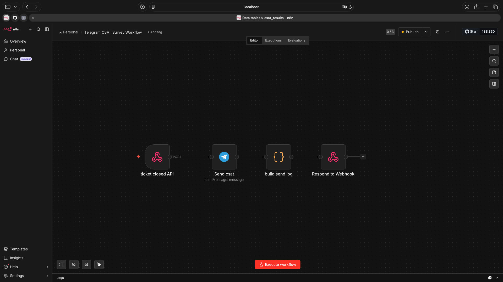
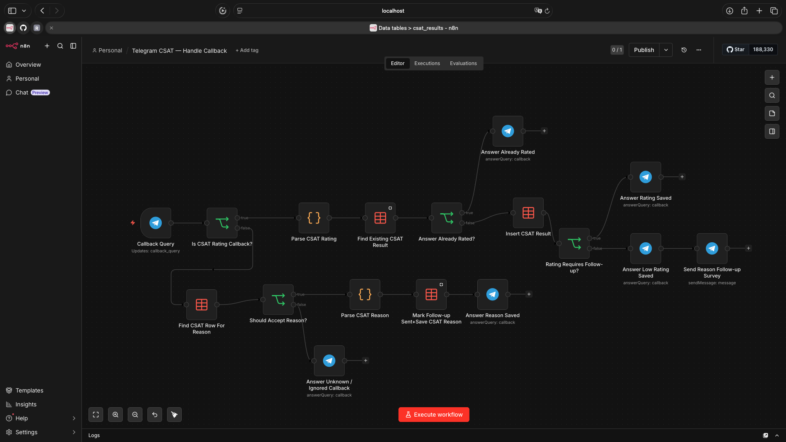
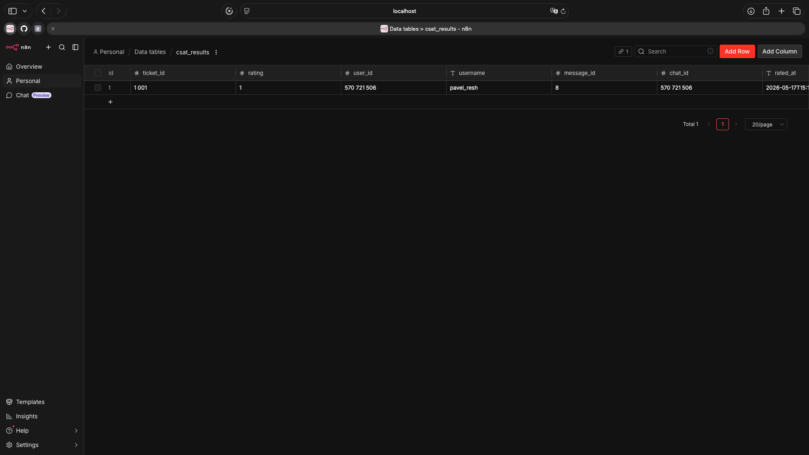

# Telegram CSAT Pipeline with n8n

A portfolio demo project for support automation built with n8n and Telegram Bot API.

The workflow simulates a support ticket closure event, sends a CSAT survey to a Telegram user, stores the rating in an n8n Data Table, prevents duplicate rating submissions, sends a follow-up question for low ratings, and saves the selected negative feedback reason.

## What this project demonstrates

This project shows a realistic support automation flow:

- receiving a ticket closure event through a webhook
- sending a Telegram CSAT survey with inline buttons
- processing Telegram callback queries
- storing CSAT results in an n8n Data Table
- preventing duplicate rating submissions
- sending a conditional follow-up for low ratings
- saving negative feedback reasons
- keeping a simple state flag with followup_sent

## Tech Stack

- n8n
- Telegram Bot API
- Telegram inline keyboards
- n8n Webhook node
- n8n Data Table
- JavaScript Code nodes
- HTTPS tunnel for local testing

## Repository Structure

    telegram-csat-pipeline-n8n/
    ├── README.md
    ├── workflows/
    │   ├── telegram-csat-send-survey.json
    │   └── telegram-csat-handle-callback.json
    ├── docs/
    │   ├── send-survey-workflow.png
    │   ├── handle-callback-workflow.png
    │   └── csat-results-table.png
    ├── examples/
    │   └── send-csat-request.sh
    └── table-schema/
        └── csat_results_schema.md

## Workflows

The project contains two n8n workflows.

## 1. Telegram CSAT Survey Workflow

This workflow receives a ticket closure event through a webhook and sends a CSAT survey message to the customer in Telegram.

Flow:

    Webhook — Ticket Closed Event
    → Telegram — Send CSAT Survey
    → Code — Build Send Log
    → Respond to Webhook

Example CSAT message:

    Please rate your support experience

    😡 Bad   😐 Okay   🙂 Good   😍 Great

Rating callback format:

    csat:<ticket_id>:<rating>

Example callback values:

    csat:1001:1
    csat:1001:2
    csat:1001:3
    csat:1001:4

Example request:

    curl -X POST "https://YOUR_N8N_URL/webhook/send-csat" \
      -H "Content-Type: application/json" \
      -d '{
        "ticket_id": 1001,
        "chat_id": "YOUR_TELEGRAM_CHAT_ID",
        "customer_name": "Demo User",
        "agent": "Support Agent",
        "queue": "Support",
        "source": "mock_crm"
      }'

For local testing with n8n test webhooks:

    curl -X POST "https://YOUR_N8N_URL/webhook-test/send-csat" \
      -H "Content-Type: application/json" \
      -d '{
        "ticket_id": 1001,
        "chat_id": "YOUR_TELEGRAM_CHAT_ID",
        "customer_name": "Demo User",
        "agent": "Support Agent",
        "queue": "Support",
        "source": "mock_crm"
      }'

## 2. Telegram CSAT — Handle Callback

This workflow handles Telegram callback queries from inline keyboard buttons.

It processes two callback types:

- CSAT rating callbacks
- negative reason callbacks

Main flow:

    Callback Query
    → Is CSAT Rating Callback?

Rating branch:

    Parse CSAT Rating
    → Find Existing CSAT Result
    → Already Rated check
    → Insert CSAT Result
    → Rating check
    → Answer Rating Saved
    → Send Reason Follow-up Survey
    → Save follow-up state

Reason branch:

    Find CSAT Row For Reason
    → Should Accept Reason?
    → Parse CSAT Reason
    → Save CSAT Reason
    → Answer Reason Saved

## Duplicate Protection

The workflow checks whether a CSAT result already exists for the ticket before saving a new rating.

If the user clicks a rating button again, the workflow answers the callback but does not create a duplicate row.

## Negative Rating Follow-up

Low ratings trigger an additional Telegram inline keyboard asking what went wrong.

Example follow-up message:

    Sorry to hear that. What went wrong with ticket #1001?

    Too slow   Not solved   Agent was rude   Other

Reason callback format:

    csat_reason:<ticket_id>:<reason>

Example reason callback values:

    csat_reason:1001:too_slow
    csat_reason:1001:not_solved
    csat_reason:1001:rude
    csat_reason:1001:other

The selected reason is saved into the same CSAT result row.

## Data Table

The workflow uses an n8n Data Table named:

    csat_results

Suggested table schema:

| Column | Type | Description |
|---|---|---|
| ticket_id | number | Support ticket ID |
| rating | number | CSAT rating from Telegram button |
| user_id | number | Telegram user ID |
| username | string | Telegram username |
| chat_id | number | Telegram chat ID |
| message_id | number | Telegram message ID |
| rated_at | string / datetime | Rating timestamp |
| reason | string | Negative feedback reason |
| reason_user_id | number | Telegram user ID for reason callback |
| followup_sent | boolean | Whether the negative follow-up was sent |
| reason_username | string | Telegram username for reason callback |
| reason_chat_id | number | Telegram chat ID for reason callback |
| reason_message_id | number | Telegram message ID for reason callback |
| reason_received_at | datetime | Reason timestamp |

## Screenshots

Send CSAT survey workflow:

Handle callback workflow:

CSAT results table:

## How to Import

1. Open n8n.
2. Import workflow JSON files from the workflows directory.
3. Configure your own Telegram credentials in n8n.
4. Create the csat_results Data Table.
5. Adjust Data Table references if needed.
6. Activate the callback workflow.
7. Trigger the send-survey workflow with the example request.

## Local Testing

Telegram webhooks require a public HTTPS URL.

For local testing, expose your local n8n instance through an HTTPS tunnel, for example with ngrok:

    ngrok http 5678

If n8n is running locally behind a tunnel, configure your n8n environment with the public webhook URL:

    environment:
      - N8N_SECURE_COOKIE=false
      - WEBHOOK_URL=https://YOUR_PUBLIC_TUNNEL_URL/
      - N8N_PROXY_HOPS=1

Then restart n8n.

## Security Notes

This repository does not include:

- Telegram bot tokens
- n8n credentials
- real customer data
- real production URLs
- ngrok URLs

After importing the workflows, Telegram credentials must be configured manually in your own n8n instance.

## What This Project Shows

This project demonstrates practical support automation skills:

- webhook-based event processing
- Telegram Bot integration
- inline keyboard callback handling
- stateful CSAT result storage
- duplicate vote protection
- conditional follow-up logic
- negative feedback reason capture
- simple support workflow design
- basic CRM-style state management

## Possible Improvements

Future versions could include:

- CRM integration
- ticket status validation before sending CSAT
- SLA or queue-based CSAT rules
- scheduled CSAT reports
- dashboard export
- agent/team-level CSAT aggregation
- retry and error handling
- production deployment behind a stable domain

## Project Status

Portfolio demo.

Built to demonstrate support automation logic with n8n, Telegram callbacks, and simple state management.
